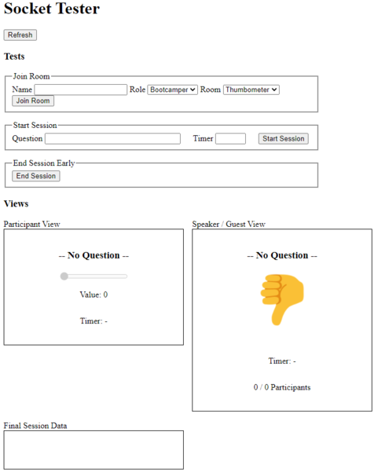

# Socket Tester

Plain HTML CSS JS psuedo front end used while learning web sockets for the EngageMate 4 week SoC project.

### To start:

1. Add your server address on line 14 of main.js
2. Run on index.html in the browser
3. make sure the back end project is running

---

